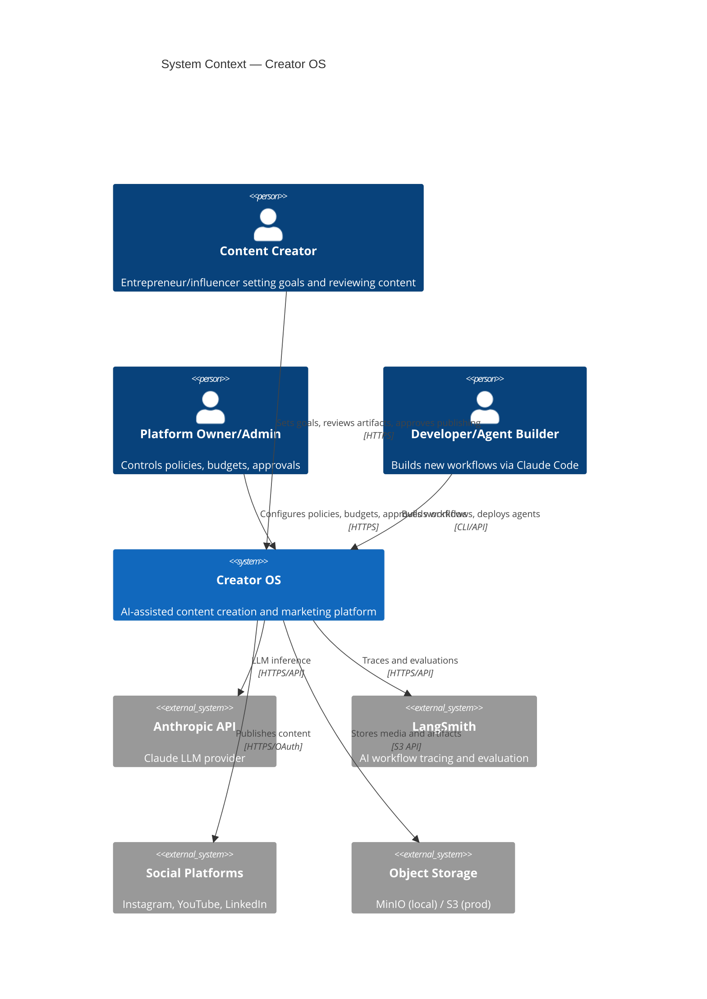
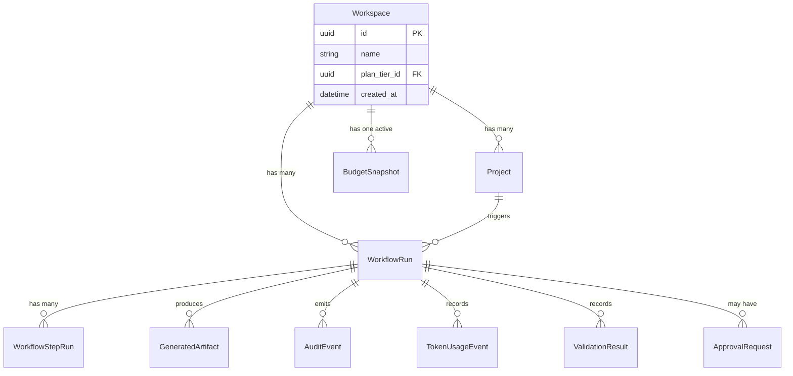
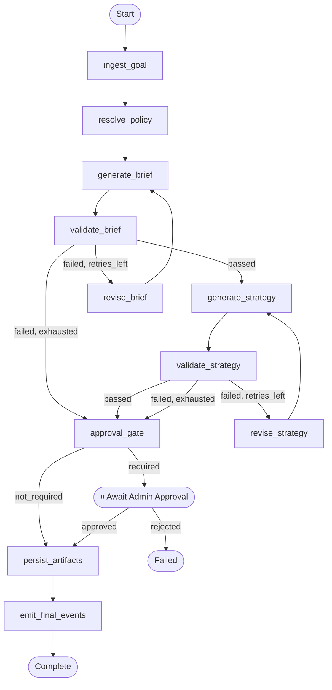

# Skill: architecture-diagram-update

Invoke whenever service boundaries, data flows, or DB schema change significantly.
Architecture diagrams are part of the PR — not an afterthought.

## Trigger Conditions
| Change | Diagrams to Update |
|--------|-------------------|
| New service or package added | container.md |
| New external system integrated | system-context.md, container.md |
| LangGraph node added/removed/renamed | component-orchestrator.md, workflow-graph.md |
| Prisma schema change (new table) | er-diagram.md |
| New workflow type implemented | workflow-graph.md |
| Key request flow changed | sequence-diagrams.md |
| New package added to monorepo | container.md |

## Diagram Files

### docs/architecture/system-context.md (C4 Level 1)


### docs/architecture/container.md (C4 Level 2)
Show all services, packages, and their communication patterns.
Each service shows: technology, responsibility, communication direction.

### docs/architecture/component-orchestrator.md (C4 Level 3)
Show inside services/orchestrator: graphs, nodes, validators, model_router, state, repositories.
Show data flow: request → graph → node → model_router → validator → artifact.

### docs/architecture/er-diagram.md


### docs/architecture/workflow-graph.md


### docs/architecture/sequence-diagrams.md
Key flows: goal intake, approval cycle, budget enforcement, auth flow.

## Diagram Rules
```
[ ] All Mermaid diagrams render without syntax errors
[ ] All relationships are labelled (protocol/pattern: HTTP, SQL, events, etc.)
[ ] Async flows use dashed arrows (--->)
[ ] External systems use a distinct style
[ ] Each diagram file has a title comment and last-updated date
[ ] Diagrams match the current code (not aspirational future state)
```

## Validate Diagrams
```bash
# Validate a single diagram
npx @mermaid-js/mermaid-cli --version  # verify installed
# Extract mermaid blocks and validate:
grep -A 100 '```mermaid' docs/architecture/container.md | grep -B 100 '```' \
  | npx mmdc -i /dev/stdin -o /dev/null 2>&1

# Or just visually verify by opening in VS Code with Mermaid preview extension
```

## After Updating Diagrams
```bash
git add docs/architecture/
git commit -m "docs(architecture): update {diagram-name} — {what changed and why}"
```
