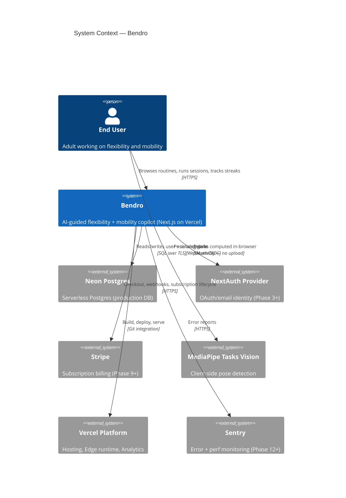
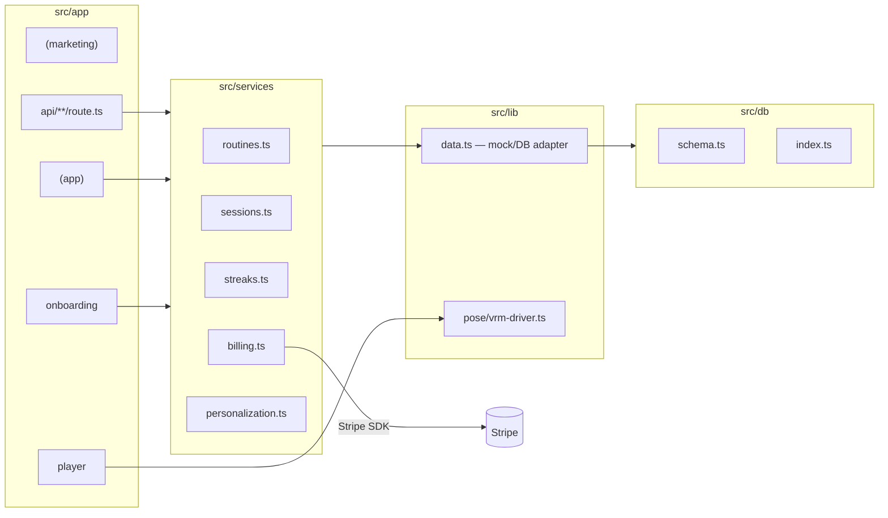
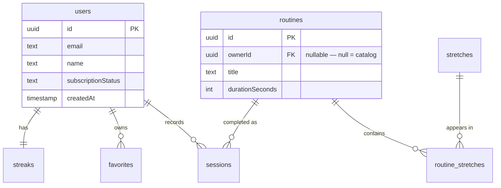
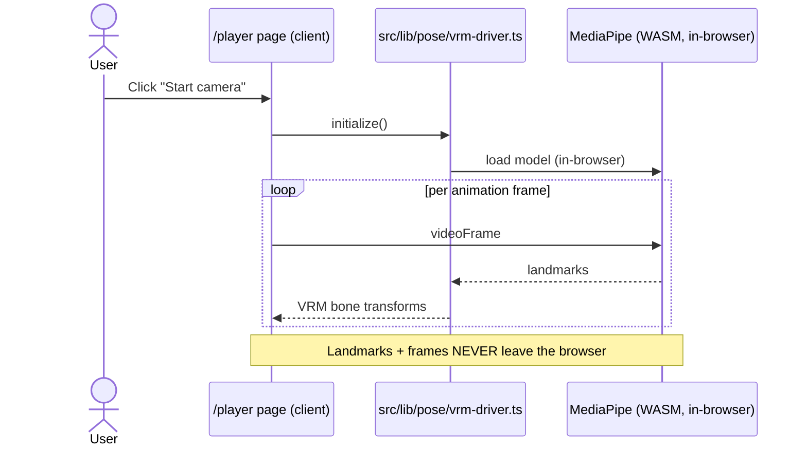

# Skill: architecture-diagram-update

Invoke whenever module boundaries, data flows, or the Drizzle schema change.
Architecture diagrams ship in the same PR as the code change — never as an afterthought.

## Trigger Conditions
| Change | Diagrams to Update |
|--------|-------------------|
| New service file added under `src/services/` | component.md |
| New external SDK wrapped (Stripe, MediaPipe, AI client) | system-context.md, component.md |
| Drizzle schema change in `src/db/schema.ts` | er-diagram.md |
| Pose / VRM driver refactor in `src/lib/pose/` | component.md, sequence-player.md |
| New route group added under `src/app/` | component.md |
| Key request flow changed (session create, streak update, checkout) | sequence-*.md |
| NextAuth, Stripe, or Neon integration wired up | system-context.md |

## Diagram Files

### docs/architecture/system-context.md (C4 Level 1)
Shows bendro and its external dependencies.



### docs/architecture/component.md (C4 Level 2/3)
Show the internal modules: route groups, services, db, lib/pose.
Annotate each with its responsibility and what it imports.



### docs/architecture/er-diagram.md
Drizzle schema as an ER diagram. Update on every `src/db/schema.ts` change.



### docs/architecture/sequence-player.md
Camera -> pose -> avatar flow. Emphasize that pose data never leaves the client.



### docs/architecture/sequence-session-create.md
Happy-path POST /api/sessions. Shows: route -> service -> data adapter -> mock OR Neon.

## Diagram Rules
```
[ ] All Mermaid blocks render without syntax errors
[ ] Every relationship is labelled with protocol/pattern (HTTPS, SQL, WASM, etc.)
[ ] Async flows use dashed arrows (-->)
[ ] External systems styled distinctly from internal modules
[ ] Each file has a one-line title and a "Last updated: YYYY-MM-DD" comment
[ ] Diagrams describe the CURRENT code, not aspirational future state
```

## Validate Diagrams
```bash
# Syntax-check by rendering to /dev/null
npx @mermaid-js/mermaid-cli -i docs/architecture/component.md -o /tmp/_.svg

# Or open in VS Code with the Mermaid preview extension
```

## After Updating Diagrams
```bash
git add docs/architecture/
git commit -m "docs(architecture): update {diagram-name} — {what changed and why}"
```
